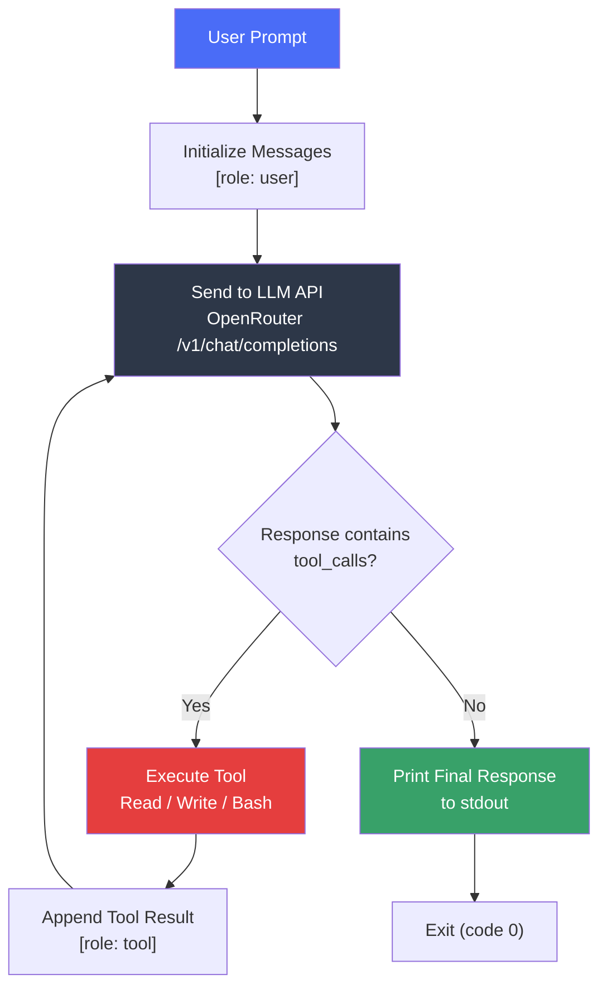
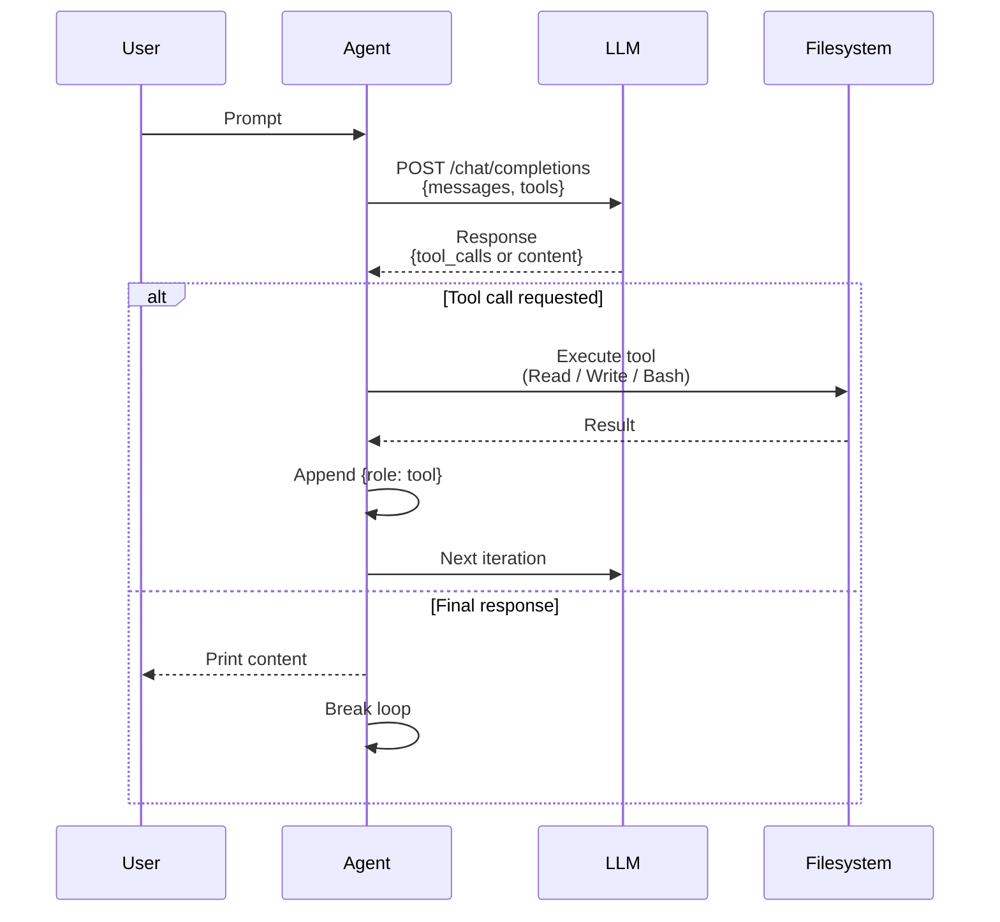
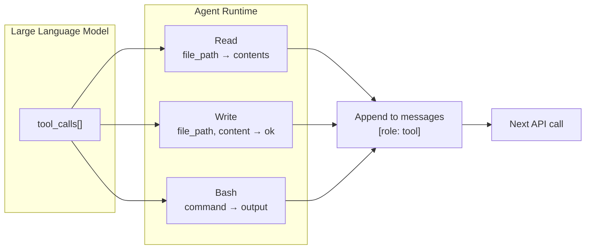

[](https://app.codecrafters.io/users/codecrafters-bot?r=2qF)

# Claude Code — Rust

A minimal AI-powered coding assistant built in Rust as part of the
["Build Your own Claude Code" Challenge](https://codecrafters.io/challenges/claude-code).

This project implements an LLM-driven agent that can read, write, and execute
commands in a filesystem environment — all through natural language instructions.
It communicates with large language models via the OpenRouter API using the
OpenAI-compatible chat completions endpoint with tool calling support.

---

## Table of Contents

- [Overview](#overview)
- [Architecture](#architecture)
- [Agent Loop](#agent-loop)
- [Tools](#tools)
  - [Read](#read)
  - [Write](#write)
  - [Bash](#bash)
- [Getting Started](#getting-started)
  - [Prerequisites](#prerequisites)
  - [Configuration](#configuration)
  - [Running](#running)
- [Build](#build)
- [Project Structure](#project-structure)
- [How It Works](#how-it-works)
- [License](#license)

---

## Overview

Claude Code is an AI coding assistant that uses Large Language Models (LLMs) to
understand code and perform actions through tool calls. This implementation
recreates that experience from scratch:

- Sends user prompts to an LLM via OpenRouter
- Advertises filesystem and shell tools for the model to invoke
- Executes requested tool calls and feeds results back into the conversation
- Repeats the cycle until the model produces a final answer

---

## Architecture

The system follows a **reactive agent loop** pattern. A single binary handles
all communication with the LLM API and tool execution.



### Key Design Decisions

| Decision | Rationale |
|---|---|
| **Rust** | Performance, safety, and zero-cost abstractions for I/O-bound work |
| **async-openai** | First-class Rust bindings for OpenAI-compatible APIs with BYOT support |
| **OpenRouter** | Single API endpoint for multiple model providers (Anthropic, OpenAI, Meta, etc.) |
| **serde_json** | Direct JSON manipulation for request construction — no custom types needed |
| **Agent loop** | Iterative tool execution enables multi-step reasoning and task completion |

---

## Agent Loop

The core of the application is an infinite loop that orchestrates the
conversation between the user and the LLM:



The loop terminates when the LLM responds with a text message instead of
requesting tool calls, at which point the message is printed to stdout and the
program exits with code 0.

---

## Tools

Tools are functions the LLM can invoke to interact with the environment.
Each tool is advertised in the API request as a JSON schema, and the model
decides when to call them based on the user's instructions.

### Read

Retrieves the contents of a file from the filesystem.

| Parameter | Type | Required | Description |
|---|---|---|---|
| `file_path` | `string` | Yes | Path to the file to read |

**Result sent back to model:** The raw file contents as a string.

### Write

Creates or overwrites a file with the specified content.

| Parameter | Type | Required | Description |
|---|---|---|---|
| `file_path` | `string` | Yes | Path of the file to write to |
| `content` | `string` | Yes | Content to write to the file |

**Result sent back to model:** Empty string (confirmation of success).

### Bash

Executes a shell command and captures its output.

| Parameter | Type | Required | Description |
|---|---|---|---|
| `command` | `string` | Yes | Shell command to execute |

**Result sent back to model:** Combined stdout and stderr output. On Windows,
commands are run via `cmd /C`; on Unix systems, via `sh -c`.



---

## Getting Started

### Prerequisites

- **Rust** 1.95 or later (edition 2024)
- An **OpenRouter** account and API key
- (Optional) A C compiler toolchain if building `ring` from source

### Configuration

Set your OpenRouter API key as an environment variable:

```sh
export OPENROUTER_API_KEY="sk-or-v1-..."
```

Optionally override the API base URL:

```sh
export OPENROUTER_BASE_URL="https://openrouter.ai/api/v1"
```

### Running

```sh
# Build and run with a prompt
./your_program.sh -p "How many files are in the current directory?"

# Ask the assistant to read a file
./your_program.sh -p "Summarize src/main.rs"

# Multi-step task: read, modify, and verify
./your_program.sh -p "Read README.md, fix any typos, then confirm the changes"
```

The `-p` / `--prompt` flag accepts any natural language instruction. The agent
will use its tools as needed and print only the final response.

---

## Build

```sh
# Development build
cargo build

# Release build (optimized)
cargo build --release
```

The compiled binary is placed at `target/debug/codecrafters-claude-code` or
`target/release/codecrafters-claude-code` respectively.

---

## Project Structure

```
.
├── Cargo.toml            # Project metadata and dependencies
├── Cargo.lock            # Locked dependency versions
├── your_program.sh       # Build and run script
├── src/
│   └── main.rs           # Single entry point — all logic
└── .codecrafters/
    ├── compile.sh        # Remote build script (CI)
    └── run.sh            # Remote run script (CI)
```

The entire application is contained in a single file (`src/main.rs`) for
simplicity. Key dependencies:

| Crate | Purpose |
|---|---|
| `tokio` | Async runtime (multi-threaded) |
| `async-openai` | OpenAI-compatible API client with BYOT support |
| `clap` | CLI argument parsing (`-p` / `--prompt`) |
| `serde_json` | JSON construction and parsing for API requests/responses |

---

## How It Works

1. **Startup** — Parse CLI arguments, load environment variables, configure the
   API client.
2. **Build request** — Construct a JSON body with the conversation history
   (`messages`) and tool advertisements (`tools`).
3. **Send** — POST to OpenRouter's `/v1/chat/completions` endpoint.
4. **Inspect response** — Check whether the model responded with `tool_calls` or
   a final `content` string.
5. **Execute or finish** — If tools are requested, run them and append results
   to the conversation; otherwise print the answer and exit.

This pattern — known as **ReAct** (Reasoning + Acting) — allows the LLM to
break down complex tasks into discrete, executable steps while maintaining full
conversation context across iterations.

---

## License

This project is part of the [CodeCrafters](https://codecrafters.io) challenge
platform. See the challenge page for terms.
