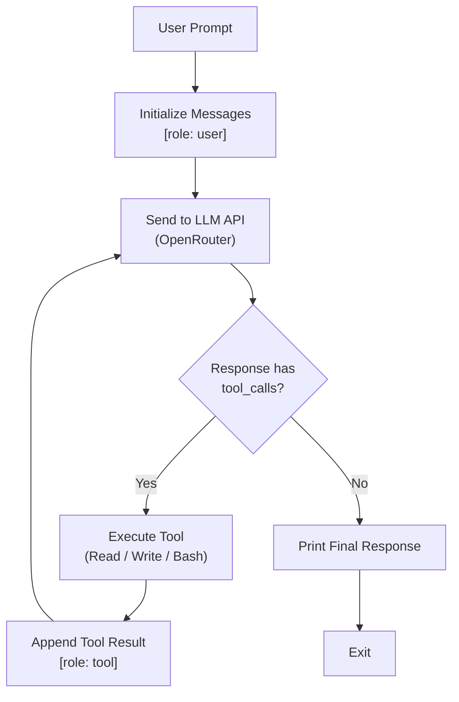
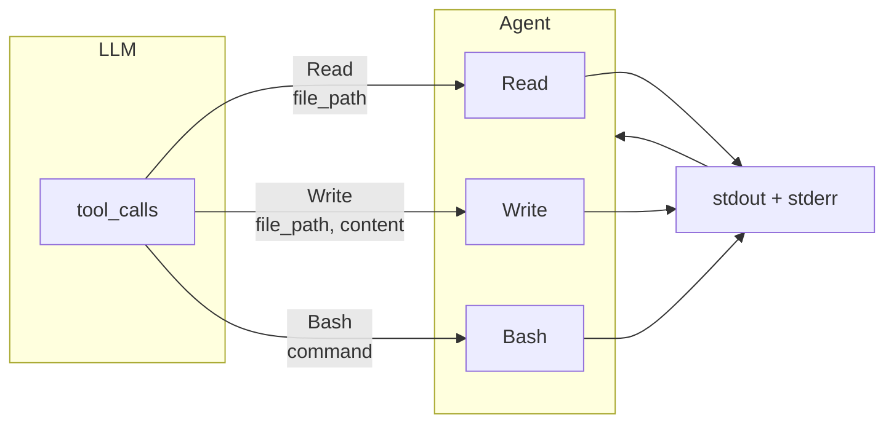

[](https://app.codecrafters.io/users/codecrafters-bot?r=2qF)

# CodeCrafters Claude Code — Rust

A minimal AI coding assistant built in Rust as part of the
["Build Your own Claude Code" Challenge](https://codecrafters.io/challenges/claude-code).

Uses LLMs via OpenRouter (OpenAI-compatible API) with an agent loop that
advertises tools, executes them, and feeds results back to the model until the
task is complete.

## Features

- **Agent Loop** — Continuously sends conversation history + tools to the LLM,
  processes tool calls, and repeats until a final text response is produced.
- **Read Tool** — Reads a file from the filesystem and returns its contents.
- **Write Tool** — Writes content to a file (creates or overwrites).
- **Bash Tool** — Executes shell commands and captures stdout/stderr output.

## Architecture



## Usage

```sh
export OPENROUTER_API_KEY="sk-..."
./your_program.sh -p "What is the content of apple.py?"
```

## Tools



## Build

Requires Rust 1.95+.

```sh
cargo build --release
```
